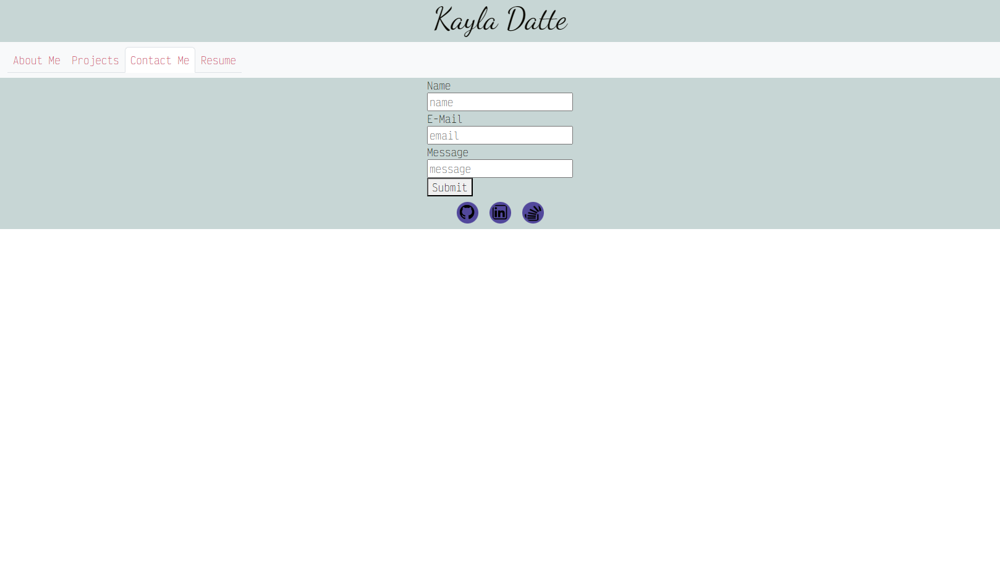

# indigo-umbrella-improved

## Description

This is a single page application using react to display my professional portfolio as a web developer. The page will display a section about me, my projects, my resume with a downloadable link, and a contact form.

## Table of Contents

If your README is long, add a table of contents to make it easy for users to find what they need.

- [Usage](#usage)
- [Contact](#contact)

## Usage

To view this page visit the link [here](https://comfy-kulfi-bcdd88.netlify.app/)
  
Navigate the page using the navigation bar at the top. 
  
Select  "About Me" when navigating to the root route to view a section about myself. 
  
 
   
Select "Projects" to view a few of the projects I've worked on.
  
 
   
Select "Contact Me" to see a contact form that alerts the user if a field is missing and checks for a valid email on submission.
  
 
   
Select "Resume" to view a list of my proficiencies and find a link to download my resume.
  
 
   

## Contact

For any questions, please contact me via the channels below:
* Github: https://github.com/kaylaasana
* E-mail: kayladatte@gmail.com
